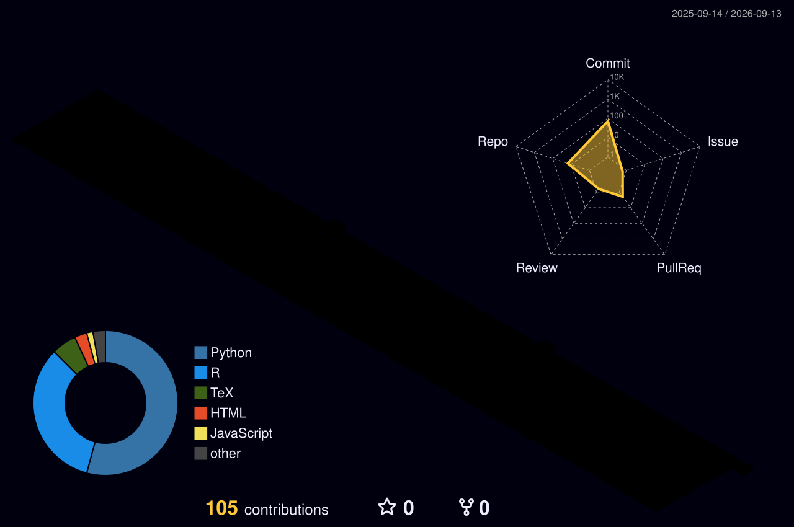

# Hi, I'm Tanay Mangal

Student at the **Massachusetts Academy of Mathematics and Science at WPI** and a **mathematical modeler + computational researcher**. I turn messy real-world problems — conservation, environmental justice, public health, economics — into optimization models, simulations, and data pipelines that produce decisions, not just numbers.

Currently a research intern at WPI working on **multiphysics simulation for metal additive manufacturing** (heat transfer, melt-pool and solidification behavior in COMSOL) and **computational physics & advanced modeling**.

[tanaymangal.com](https://www.tanaymangal.com/) · [LinkedIn](https://www.linkedin.com/in/tmangal/)

---

## Featured projects

**[Etosha National Park — Wildlife Conservation](https://github.com/TanayMangal/Etosha-National-Park)** · *IMMC 2026*
A two-model conservation-optimization framework for Etosha (940 grid cells, five ecological guilds, wet/dry seasons): a priority pipeline (modules M0–M12 → a park-wide Species Protection Rate) plus resource allocation combining circuit-theory infrastructure analysis, a two-stage stochastic program, and ICER cost-effectiveness for placing patrols, drones, and sensors.
`Python` · `NetworkX` · `scikit-learn` · `GeoPandas`

**[Rhino Anti-Poaching Patrol Routing](https://github.com/TanayMangal/Rhino-Anti-Poaching)**
Coverage-oriented patrol routing, formulated as a multi-depot Team Orienteering Problem and solved on the real OpenStreetMap road network with Google OR-Tools.
`Python` · `OR-Tools` · `SciPy` · `OpenStreetMap`

**[Graph Diffusion for Environmental Justice](https://github.com/TanayMangal/Graph-Diffusion-Everest)**
A 486-node, 20,303-edge spatial influence network modeling transportation pollution exposure in Chelsea and Everett, MA. A steady-state graph diffusion equation ranks four equity-focused policy interventions; anti-idling near schools emerged strongest.
`Python` · `NumPy` · `SciPy` · `GeoPandas`

**[M3C — Sports Gambling Economic Impact](https://github.com/TanayMangal/Sports-Gambling-Effects)** · *MathWorks M3 Challenge 2026 (Top 20%)*
A multi-stage framework estimating disposable income (OLS + TabNet ensemble over a ~1M-row grid), simulating gambling outcomes (Monte Carlo, Poisson processes, fractional Kelly), and modeling social contagion of harmful behavior.
`Python` · `PyTorch (TabNet)` · `pandas`

**[HiMCM 2025 — Emergency Evacuation Sweep Optimization](https://github.com/TanayMangal/Building-Route-Optimizing-HiMCM)** · *Meritorious, top 13%*
Dynamic model for firefighter search-and-sweep in hazardous multi-floor buildings: graph-based routing, Dijkstra path optimization, and A*-style fire-origin estimation from smoke patterns.
`Python`

**[ARTICULATE — AI Speech Accessibility Platform](https://github.com/MohammadKGolji/A.R.T.I.C.U.L.A.T.E)** · [live demo](https://huggingface.co/spaces/PINEAPPLEANANAS/SpeechCorrection)
Browser-based tool that transcribes atypical speech with a fine-tuned Whisper model and repairs grammar with a Flan-T5 language model — for people with dysarthria, Down syndrome, and other speech disabilities. Accessibility-first design with high-contrast mode and live waveform feedback.
`Python` · `Whisper` · `Flan-T5` · `Hugging Face`

**[Personal Website](https://www.tanaymangal.com/)**
My portfolio and personal site.

---

## Skills & tools

**Languages:** Python, MATLAB, LaTeX
**Modeling & optimization:** Google OR-Tools, SciPy, NetworkX, linear & two-stage stochastic programming, graph/network models, Monte Carlo
**Data & ML:** NumPy, pandas, scikit-learn, PyTorch / TabNet
**Scientific computing:** COMSOL, numerical simulation, PDE/diffusion models
**Geospatial:** GeoPandas, Shapely, OpenStreetMap
**Visualization & workflow:** Matplotlib, seaborn, Git/GitHub

---

## Math modeling — competitions & honors

- **HiMCM 2025** (COMAP) — Meritorious Award, top 13% internationally; advanced to **IMMC 2026**
- **M3 Challenge 2026** (MathWorks) — Top 20% international
- **Modeling the Future Challenge** (Actuarial Foundation) — New England Finalist (top 3 district / top 15 nation) and **Climate Resilience Award Finalist**
- **Purple Comet Math Meet 2026** — 1st in Massachusetts, 15th in the U.S., 51st worldwide (28/30)
- **ACSL Finals 2026** — Bronze, Senior Division (international computer science)
- **IMC Prosperity 2026** — Top 25% worldwide; led a 5-person algorithmic-trading team
- **FIRST Leadership Award** — Semi-Finalist (1 of 2 selected from 54 students)
- **MathCON** — National Qualifier (97th percentile) · **2x MAML Finalist** · Top 5 Varsity, WOCOMAL

---

## Beyond modeling

- **Co-Founder & Programs Lead, Tech Awareness Association** — student-led nonprofit teaching device repair, e-waste reduction, and digital literacy; 120+ devices repaired, expanded to 5 towns, partnership with iFixit
- **FIRST Robotics Competition, Team 190** (Mass Academy / WPI) — prototyping & CAD (Onshape), Impact Award team
- 2nd Dan Black Belt & instructor, Taekwondo

---

## My GitHub in 3D

<!-- Auto-generated by the profile-3d-contrib GitHub Action (see setup note below). -->

## Stats

  
  

  

